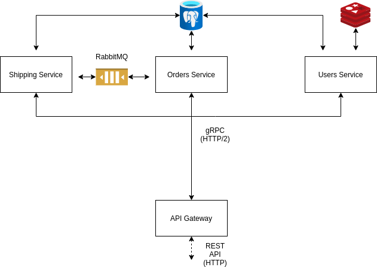

# Golang Microservices

Example developed 100% in Golang using the Microservices architecture and the following features:

- Databases: PostgreSQL (SQL) and Redis (NoSql)
- RabbitMQ
- API (gRPC) Gateway

## Getting Started

You can run the example using `docker-compose`
